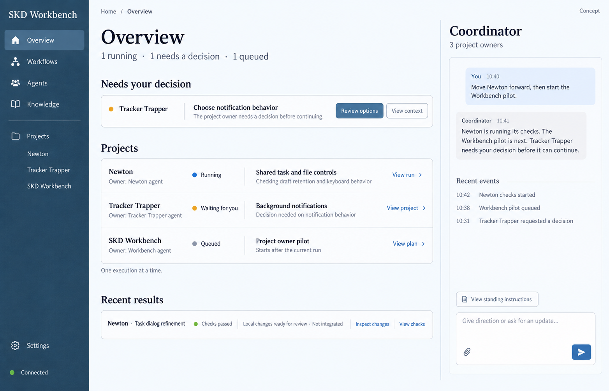
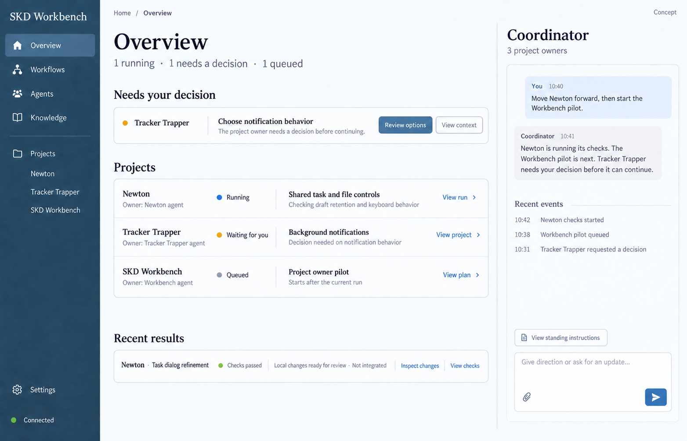
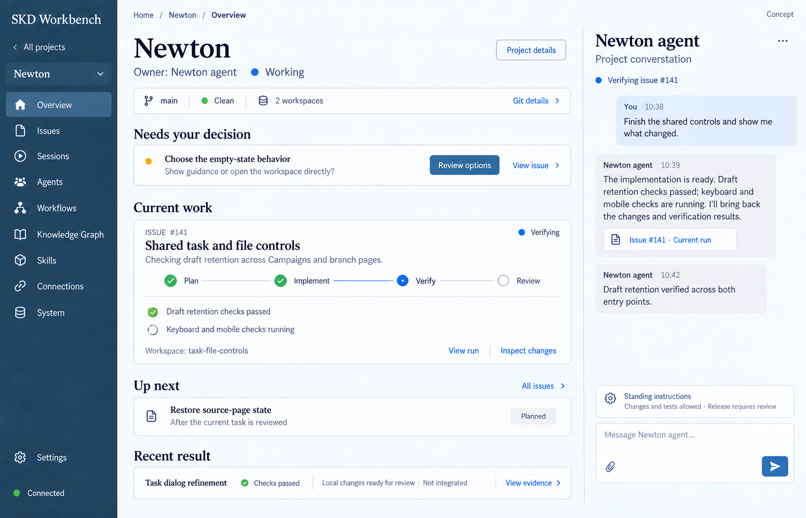

# Project-agent design passes — 2026-09-23

Reference for [issue #14](https://github.com/shelbyklein/skd-workbench/issues/14). Generated with the built-in image generation tool; concept images use illustrative project states, not live runtime evidence.

## 1. Initial overview — superseded

Initial prompt direction: a coordinator conversation beside project ownership, decisions, current work and recent results, using the Workbench slate-blue visual direction.

## 2. Revised overview — accepted visual direction

Requested edit: remove only “One execution at a time.” Keep the remaining design. The user subsequently clarified that the methodology must integrate into existing individual project views, not become another dashboard layer. Home should summarize those same project records.

## 3. Individual project view — latest proposal

Prompt direction: carry the approved visual treatment into the existing Newton Project Overview. Retain project navigation; integrate project agent conversation, compact Git context, decisions, current work with verification evidence, next work and recent results. Link existing Issues, Workflows, Sessions and lifecycle records. Avoid duplicate dashboards and the removed execution caption.

This pass is proposed and has not yet received explicit visual acceptance. Permission wording, example issue states, checks and messages are illustrative; they are not active grants or verified project progress.

The existing execution lock remains an implementation constraint, not a permanent decorative UI caption. No feature implementation, server activation or live execution was performed for these references.
