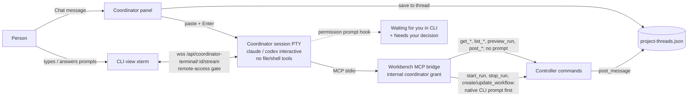

# Coordinator CLI view: a live Claude Code / Codex session

Issue: https://github.com/shelbyklein/skd-workbench/issues/16 · Tracker Trapper plan `E57D19CA-B394-417F-A0BE-2F3B08F7B5B0`
(todos CC-01…CC-09 match the Workflow table and the issue checklist).

## Summary

The coordinator conversation (Home and project panels) currently answers each message with a one-shot, screenless
Claude Code or Codex run, and only shows "Replying…" and then the final text. This plan replaces that with one
ongoing interactive Claude Code or Codex session per conversation, running in a real terminal. The person can switch
the panel between Chat and a live CLI view, watch the agent work and call its Workbench tools, and answer its native
permission prompts before it starts or changes work.

## Problem

Observed today (`main` e0b10be):

- `lib/coordinator-agent.js` `args()` runs `claude --print --output-format stream-json … --permission-mode dontAsk
  --tools '' --allowedTools mcp__workbench` or `codex exec --json … approval_policy="never"
  default_tools_approval_mode="approve"`. `consume()` keeps only the final text and tool names; the reply is posted by
  the Workbench (`threads.post`). No terminal exists for the person to see.
- `public/project-agent-ui.js` shows "Replying…" while a turn runs and the reply afterwards
  (screenshot: [current-home-coordinator.webp](assets/coordinator-cli/current-home-coordinator.webp)).
- Every Workbench tool, including `start_run`, `stop_run`, `create_workflow`, `update_workflow`, runs without asking.
- Interactive agent terminals exist (`lib/terminals.js` `TerminalSessions`), but they hold the single execution lock
  (`executor.owner`) and include worktrees; they are the wrong owner for a coordinator that has no file or shell tools.
  The streaming interface (`output/subscribe/input/resize` in `lib/workspace-terminal.js`), `attachTerminalStreams`
  (`lib/terminal-stream.js`) and the xterm client (`public/terminal-ui.js` `mountTerminal`) are reusable.

Affects: the person using the coordinator, who cannot see or approve what it does.

## Target

Mockup: [target-cli-view.svg](assets/coordinator-cli/target-cli-view.svg).

## Settled decisions

- Real interactive CLI (not a rendered step log); one ongoing session per conversation key (Home coordinator thread,
  each project thread).
- Chat messages are saved as today and typed into the session (bracketed paste + Enter). The person can also type in
  the CLI. The agent posts its replies to the chat with `post_message` / `post_coordinator_message`.
- No approval: `get_*`, `list_*`, `preview_run`, `post_message`, `post_coordinator_message`. Native CLI prompt:
  `start_run`, `stop_run`, `create_workflow`, `update_workflow`. Mandate checks stay in the controller commands.
- A waiting permission prompt shows "Waiting for you in CLI" in the panel and an entry under Needs your decision.
- No file or shell tools; the session stays outside the execution lock, like today's coordinator lane.
- Session starts on the first message (seeded with the last 30 chat messages and coordinator instructions); ends on
  Stop, provider/model/effort change, coordinator off, 30 minutes idle, or server stop. Restart never resumes.
- History: read-only terminal transcripts of the last 20 sessions, 256 KiB tail each, in the data directory.
- Chat stays the default view; the panel has a Chat / CLI switch. Works remotely through the existing gate.

## Success criteria

1. With a fixture interactive CLI, a chat message appears as input in the live CLI view and the agent's reply appears
   in the chat — browser test on Home and a project panel, desktop and mobile.
2. Restrictions hold: generated Claude args contain no built-in tools, strict MCP config, allowed tools = the no-prompt
   list only, and no `dontAsk`/`bypassPermissions`; Codex config marks the four action tools as prompting — Node tests.
3. A permission-prompt signal puts the session in "waiting" and adds a Needs your decision entry that clears on input —
   Node and browser tests with the fixture.
4. Lifecycle: idle timeout, Stop, settings change and server restart end the session without resume; one PTY per
   conversation; history is bounded — Node tests; full `npm test` and `npm run test:browser` pass.
5. Real providers (after go-ahead): one Claude Code and one Codex session show a reply posted from the CLI, a read tool
   used without a prompt and a native prompt for `start_run` (declined) — screenshots inspected.

## Deliverables

| Deliverable | End state |
| --- | --- |
| `lib/coordinator-sessions.js` (PTY manager, args, lifecycle, history) + migration of `coordinator-agent.json` | Committed on a feature branch |
| Stream path `/api/coordinator-terminal/:id/stream`, session/stop/history routes, permission signal endpoint | Committed |
| Panel Chat / CLI switch, live xterm view, waiting banner, Needs your decision entry, history list; `sw.js` bump | Committed |
| Tests (Node + browser, fixture CLI), README / AGENTS.md / VALIDATION.md | Committed |
| Real-provider check (Claude Code, Codex) | After the person's go-ahead |
| Merge to `main`, push, live server restart | After the person's go-ahead |

## Workflow

| ID | Task | Acceptance |
| --- | --- | --- |
| CC-01 | Confirm CLI capabilities without inference: Claude interactive flags (`--tools ''`, `--strict-mcp-config`, `--allowedTools` per tool, default permission mode, `--settings` Notification hook for permission prompts); Codex interactive per-tool MCP approval config and an approval-waiting signal. Record findings and the fallback in this plan | Findings section written with `--help`/docs/config evidence; each item marked confirmed or fallback; no provider inference run |
| CC-02 | Add `lib/coordinator-sessions.js`: one PTY per conversation key, provider args, seeded first prompt, message input (bracketed paste + Enter), Stop, settings-change end, 30-min idle end, shutdown without resume, bounded output; migrate `coordinator-agent.json` (backup first) keeping settings and legacy turns readable | Node tests with fake `pty.spawn`: args restrictions (criterion 2), one PTY per key, paste sequence written, idle/Stop/settings/shutdown end without respawn, migration keeps settings and writes a backup, corrupt file fails visibly |
| CC-03 | Route chat messages into the session and let replies come from `post_message` under the coordinator grant; remove the headless turn runner | Node test with a fixture interactive CLI that reads input and calls the controller `post_message`: reply appears once in the right thread with the coordinator controller name; no headless process spawned |
| CC-04 | Permission-waiting signal (Claude Notification hook → loopback, grant-authenticated endpoint; Codex per CC-01) → session `waiting`, panel banner, Needs your decision entry; cleared on input or end | Node tests: signal from the fixture sets waiting and adds a decision for the right project/Home; input clears it; unauthenticated or remote signal refused |
| CC-05 | History: persist last 20 session tails (256 KiB) atomically; read-only list and viewer | Node test: 21st session evicts the oldest, tail capped, survives restart as read-only (no input accepted) |
| CC-06 | UI and stream: `attachTerminalStreams` handles `coordinator-terminal`; panel Chat / CLI switch, live xterm (`mountTerminal`), Stop, waiting banner, history; `sw.js` cache bump | `tests/coordinator-cli-browser.mjs`: toggle, live output, chat → CLI input, CLI typing, reply in chat, hide/reopen without respawn, waiting banner + decision, history viewer, keyboard, mobile 390 px, dark; `remote-access-server` test covers the new stream path; screenshots inspected |
| CC-07 | Docs and full validation | README, AGENTS.md (coordinator lane now interactive, prompts for action tools), VALIDATION.md; `npm test` and `npm run test:browser` pass |
| CC-08 | **Gate (person's go-ahead, uses account):** real Claude Code and Codex sessions | Criterion 5 met; screenshots inspected; findings recorded |
| CC-09 | **Gate (person's go-ahead):** merge to `main`, push, restart the live server after checking active execution | `origin/main` equals the verified commit; new server PID; local health 200; remote still gated |

Order: CC-01 → CC-02 → CC-03 → CC-04 → CC-05 → CC-06 → CC-07 → CC-08 → CC-09.

Coordination: before CC-02, confirm the session that built `codex/coordinator-agent` is no longer changing
`lib/coordinator-agent.js`, `public/project-agent-ui.js` or `tests/coordinator-*`; work on a branch from current `main`.

## CC-01 findings (2026-09-23, no inference)

Claude Code 2.1.281 (`claude --help`, binary strings):
- Confirmed: `--tools ""` disables all built-in tools; `--strict-mcp-config` + `--mcp-config`; `--allowedTools`
  per tool (`mcp__workbench__<tool>`); `--permission-mode manual` prompts for anything not allowed; `--settings` JSON
  hooks with a `Notification` hook and `permission_prompt` matcher (strings present); `--setting-sources` limits
  user/project/local settings (keeps personal hooks and plugins out). `--bare` would skip keychain reads (sign-in), so
  it is not used. `--no-session-persistence` is print-only, so interactive sessions are saved by Claude Code.
- To verify at CC-08: first run in the coordinator workspace may show Claude's folder-trust prompt (answered once in
  the CLI view); personal `~/.claude/CLAUDE.md` may still be read as context.

Codex CLI 0.155.1 (`codex --help`, `codex mcp list`, binary strings):
- Confirmed: per-tool MCP approval `mcp_servers.<server>.tools.<tool>.approval_mode` = `auto|prompt|writes|approve`
  and `default_tools_approval_mode`; hook events include `PermissionRequest`, `PreToolUse`, `PostToolUse`, `Stop`;
  `--dangerously-bypass-hook-trust` exists (hooks need trust). Interactive `codex` has no `--ignore-user-config`
  (only `codex exec` does).
- Isolation problem: interactive Codex loads `~/.codex/config.toml` (19 MCP servers here, including `computer-use`,
  `node_repl`). `-c mcp_servers={}` merges rather than replaces; per-server `-c mcp_servers.<n>.enabled=false` left 8
  servers enabled (`codex mcp list --json`). A separate `CODEX_HOME` has no user servers but also no sign-in
  (`~/.codex/auth.json`). Decision needed; see Open questions.

## Scope boundaries

Excluded: file or shell tools for the coordinator; new Workbench MCP tools; changing mandate rules; multiple
simultaneous sessions per conversation; resuming sessions after restart; a rendered step-log view.

Must not change: project threads data and message history; coordinator settings (provider, model, effort, enabled);
the internal coordinator grant model and mandate checks; loopback binding and the remote-access gate (the new stream
and routes go through it); execution lock ownership for sessions and workflows; explicit PWA updates.

## Rollback

- Before migrating `coordinator-agent.json`, write `coordinator-agent.json.schema-1.<uuid>.backup.json`; restoring it
  and reverting the merge returns to headless replies. New file `coordinator-sessions.json` can be deleted.
- `git revert` the merge commit; restart the server after checking active execution.

## Test plan

- Node: `node --test tests/coordinator-sessions.test.js tests/remote-access-server.test.js`, then `npm test`.
- Browser: `node tests/coordinator-cli-browser.mjs` (fixture interactive CLI via fake binary in a real PTY; Home and
  project panels; desktop, 390 px mobile, dark), then `npm run test:browser`.
- Rendered checks: screenshots of Chat, CLI live, waiting banner and history inspected.
- Real providers only at CC-08 with the person's go-ahead; report fixture tests, CLI startup and inference separately.

## Open questions

- Codex per-tool approval and a `PermissionRequest` hook exist (CC-01). **Blocking for the Codex path:** how to keep
  personal Codex MCP servers out of an interactive session (see CC-01 findings). Claude Code work is not blocked.

## Work preparation

- Scope: confirmed 2026-09-23 (real CLI screen; one ongoing session per conversation; read/post free, act tools
  prompt; keep last 20 transcripts).
- Plan: this file. Tracking: issue #16, Tracker Trapper `E57D19CA-B394-417F-A0BE-2F3B08F7B5B0`.
- Mode: `linear` (solo). Executor: this Claude Code session, Opus 5.5 (`claude-opus-5-5`) at the session's current
  effort setting; no subagents. Recipient/handoff: none.
- Now/later: _asked after readiness_.
- Readiness: pass · 2026-09-23 · R3 current screenshot, mockup and flow diagram above · R11 Codex capability question
  non-blocking with a stated fallback · R12 rollback above (settings migration).
- Remaining questions: Codex per-tool approval (CC-01), non-blocking.
