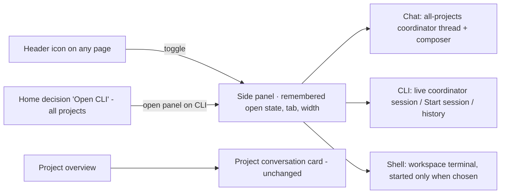

# Coordinator side panel: Chat / CLI / Shell on every page

Issue: https://github.com/shelbyklein/skd-workbench/issues/17 · Tracker Trapper plan `CBE87726-0245-4A5A-89BD-C936C998AA3E`
(todos SP-01…SP-05 match the Workflow table and the issue checklist). Related: #16 (coordinator CLI view).

## Summary

The header terminal icon currently opens a right-side panel with only a plain shell in the Workbench folder, and
the all-projects coordinator lives in a card on Home. This plan turns that side panel into a tabbed panel with the
all-projects coordinator (**Chat**, **CLI**) and the existing workspace shell (**Shell**), available from every page
and kept open across navigation. The Home coordinator card is removed; project conversation cards stay.

## Problem

Observed (`main` 0867e31):

- `public/app.js` adds a header button (`data-workspace-terminal`) on every page; clicking it POSTs
  `/api/workspace-terminal` and mounts `mountTerminal({session,api,workspace:true})` — a body-level, resizable
  `.workspace-terminal-panel` (width in `localStorage` `workspace-terminal-width`, body class
  `workspace-terminal-open`). It can only show the shell (screenshot:
  [current-workspace-terminal.webp](assets/coordinator-dock/current-workspace-terminal.webp)).
- The all-projects coordinator (chat, CLI, Start session, history, waiting banner) exists only in the Home card
  built by `mountHomeAgents` (`public/project-agent-ui.js`, `threadAside` + `coordinatorPanel`), so it is unavailable
  while working on any other page.

Affects: the person, who has to go back to Home to talk to or watch the coordinator.

## Target

Sketch: [target-dock.svg](assets/coordinator-dock/target-dock.svg).

## Settled decisions (2026-09-23, person)

- Panel always shows the **all-projects** coordinator; project conversations stay in project overview cards.
- Tabs **Chat / CLI / Shell**; Shell is today's workspace terminal (started only when Shell is chosen; hiding keeps
  it running; End session stops it).
- **Toggle with the icon**: closed by default; once opened it stays open across navigation until hidden; open state,
  last tab and width are remembered per browser (`localStorage`, wrapped in try/catch).
- Home Coordinator card removed; Home "Open CLI" for an all-projects decision opens the panel on CLI.

## Success criteria

1. From Home, a project overview and Workflows, the header icon opens the panel; switching pages keeps it open with
   the same tab, and a running CLI session is not restarted — browser test.
2. Chat, CLI (Start session, live output, typing, Stop, history, waiting banner) work in the panel as they did in the
   Home card — browser test with the fixture CLI.
3. Shell tab starts the workspace shell only when chosen, and hiding/reopening does not respawn it — browser test.
4. Home shows no coordinator card; an all-projects "Waiting for you" decision's Open CLI opens the panel on CLI;
   project overviews keep their conversation card — browser test.
5. Full `npm test` passes; browser suites pass except the known environmental `editor.mjs` ratio check.

## Deliverables

| Deliverable | End state |
| --- | --- |
| `public/coordinator-dock.js` (panel, tabs, persistence, resizer), `app.js` header wiring | Committed |
| `project-agent-ui.js`: reusable all-projects conversation mount; Home card removed | Committed |
| CSS, `sw.js` cache bump, `server.js` asset allowlist entry for the new module | Committed |
| Tests (`coordinator-dock-browser.mjs`; updates to `coordinator-cli-browser`, `workspace-terminal-browser`) | Committed |
| README / VALIDATION.md | Committed |
| Push to `main` + live restart | After the person's go-ahead |

## Workflow

| ID | Task | Acceptance |
| --- | --- | --- |
| SP-01 | Extract the all-projects conversation (thread, composer, coordinator panel, refresh loop) into a mount usable outside Home; remove it from `mountHomeAgents` | Home renders without the card (no `#agent-composer` on Home); `project-agent-browser` still passes |
| SP-02 | Add `public/coordinator-dock.js`: body-level resizable panel with Chat / CLI / Shell tabs and Hide; persistence of open state, tab and width; header icon toggles it; Shell tab mounts the workspace terminal inline on demand | `coordinator-dock-browser.mjs`: open from Home, project and Workflows; navigation keeps panel/tab; Shell starts only when chosen and reattaches without respawn; width/tab persist across reload |
| SP-03 | Wire Home "Open CLI" (all-projects) to open the panel on CLI; keep project decisions on the project card | Browser test: waiting decision on Home opens panel CLI with the prompt |
| SP-04 | Update existing browser tests, docs, `sw.js` bump and asset allowlist; run full suites | `npm test` passes; browser suites pass except known `editor.mjs`; screenshots (desktop, dark, 390 px) inspected |
| SP-05 | **Gate (person):** push to `main` and restart the live server after checking active execution | `origin/main` equals the verified commit; new server PID; health 200; remote still gated |

Order: SP-01 → SP-02 → SP-03 → SP-04 → SP-05.

## Scope boundaries

Excluded: panel following the current page; changes to project conversation cards, session behaviour, prompts,
data files or APIs (beyond serving the new module); a new shell implementation.

Must not change: workspace shell process semantics (never auto-start, hide keeps running, End session stops);
coordinator session lifecycle and permission prompts; remote-access gating; explicit PWA updates; drafts.

## Rollback

No data or schema change. `git revert` the delivery commit and restart the server; `localStorage` keys for the panel
are ignored by the old code.

## Test plan

- `node tests/coordinator-dock-browser.mjs` (new), `node tests/coordinator-cli-browser.mjs`,
  `node tests/workspace-terminal-browser.mjs`, `node tests/project-agent-browser.mjs`.
- `npm test`; `npm run test:browser` (known environmental `editor.mjs` failure reported separately).
- Rendered checks: screenshots of the panel on Home and a project page (Chat, CLI, Shell), dark theme and 390 px.

## Open questions

None blocking.

## Work preparation

- Scope: confirmed 2026-09-23.
- Tracking: issue #17, Tracker Trapper `CBE87726-0245-4A5A-89BD-C936C998AA3E`.
- Mode: `linear` (solo), this Claude Code session, Opus 5.5 (`claude-opus-5-5`) at its current effort; no subagents.
- Now/later: _asked after readiness_.
- Readiness: pass · 2026-09-23 · R3 current screenshot, sketch and flow diagram · R12 no data change (revert only).
