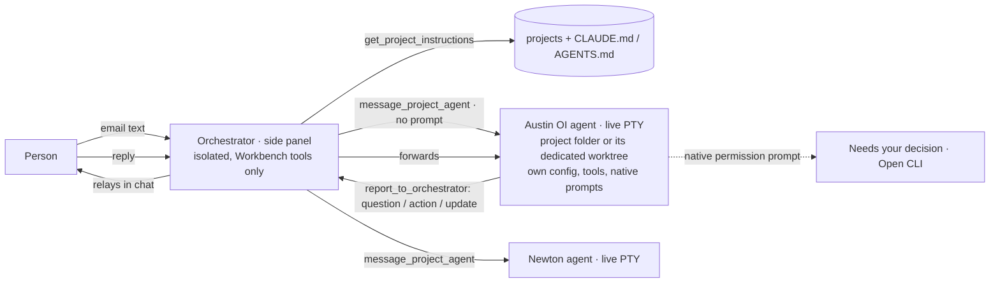

# Hub orchestrator: route work to live project agents

Issue: https://github.com/shelbyklein/skd-workbench/issues/18 · Tracker Trapper plan `EAAFEE50-1CDB-4D4D-B979-6CC7946B3DED`
(todos HO-01…HO-08 match the Workflow table and the issue checklist). Related: #16, #17.

## Summary

SKD Workbench should be one hub: it pulls in issues, gives access to each project, and is the one place where work
gets executed. The person talks to the **orchestrator** (the all-projects coordinator in the side panel), e.g. "I got
this email about Austin OI: …". The orchestrator recognizes the project, hands the request to that project's **live
agent**, and relays the agent's questions, needed actions and updates in its own chat; the person answers there and
the orchestrator passes answers back. Several projects' agents can work at the same time. Workflows, delegation and
mandates leave the main path.

## Problem

Observed (`main` 7c94ac6):

- The orchestrator can only list projects, read records and use workflow tools (`start_run` requires a mandate); it
  has no way to hand a request to "the Newton agent" (`lib/controller-catalog.js`, `lib/coordinator-agent.js`
  `instructions()`).
- Project conversation cards run a **restricted** coordinator session in the Workbench's own
  `coordinator-workspace` with no file or shell tools (`lib/coordinator-sessions.js` `sessionArgs`), so they cannot do
  project work or use the project's `CLAUDE.md`/`AGENTS.md`, MCP servers or skills.
- One global execution lock (`executor.owner`, checked in `lib/terminals.js`, `lib/workflows.js`,
  `lib/delegations.js`, `lib/workspace-tasks.js`, `lib/quick-actions.js`) allows only one agent at a time.
- The main path still centres on workflows, delegation and mandates (sidebar Workflows, Home "Global pages" and
  "Project owners", project "Up next", mandate card, Workflows → Delegate task), which do not match how work is done.

Current screenshots: [orchestrator panel](assets/hub-orchestrator/current-orchestrator-panel.png),
[project card CLI](assets/hub-orchestrator/current-project-card-cli.png).

## Target

Mockup: [target-relay.svg](assets/hub-orchestrator/target-relay.svg).

## Settled decisions (person, 2026-09-23)

- Project agent = one live Claude Code / Codex session per project (watch/type in the project card's Chat / CLI);
  it keeps context across requests until stopped, idle or restart. The project conversation card becomes this agent.
- It runs in the **project folder** by default with the user's normal CLI config, tools, `CLAUDE.md`/`AGENTS.md` and
  native permission prompts. **Per-project setting:** run in a dedicated worktree instead (created once on an
  `agent/<project>` branch, reused across requests, never deleted automatically; requires a Git repository).
- Concurrency: **one agent per project**, different projects in parallel; a new request goes to the existing session.
- Model: **per-project default** provider / model / effort, set in the project's agent settings.
- Relay: **orchestrator chat only** — agent reports appear in the orchestrator's conversation (attributed to the
  project agent) and are typed into the orchestrator's live session if one is running; the person replies there.
- Routing: **free** — `message_project_agent` needs no approval; stopping an agent (`stop_project_agent`) prompts.
- Workflows, delegation and mandates are **hidden from the main path**; data, routes and APIs keep working.
- The orchestrator itself stays isolated (no file or shell tools), as in #16.

## Success criteria

1. With fixture CLIs, a message to the orchestrator ("email about <Project A>") results in <Project A>'s agent
   starting in the right folder with that text, and a second project's agent running at the same time — Node e2e.
2. A project agent's `report_to_orchestrator` question appears in the orchestrator chat attributed to that project;
   the person's reply in the orchestrator chat reaches that agent's session — Node e2e and browser test.
3. Project agent sessions use the project folder (or the dedicated worktree when set), no `--strict-mcp-config`, no
   `--tools ""`, no private `CODEX_HOME`, native prompts not bypassed, plus the Workbench MCP server — Node tests.
4. Per-project locking: an old-style run in a project blocks that project's agent start and vice versa; other
   projects are unaffected — Node tests.
5. Main path hides Workflows, Delegate task, mandates, Up next and Project owners while their routes still render;
   full `npm test` passes; browser suites pass except the known environmental `editor.mjs` — test runs + screenshots.

## Deliverables

| Deliverable | End state |
| --- | --- |
| Per-project agent settings (provider, model, effort, workspace) in `coordinator-agent.json` (additive field) + project Settings dialog | Committed |
| Project agent sessions (args, folder/worktree, Workbench MCP with `report_to_orchestrator`), per-project lock | Committed |
| Orchestrator tools (`get_project_instructions`, `message_project_agent`, `get_project_agent`, `stop_project_agent`), relay, instructions | Committed |
| Main-path hiding of workflows, delegation, mandates | Committed |
| Tests, README, AGENTS.md, VALIDATION.md, `sw.js` bump | Committed |
| Real-provider check (orchestrator routes to one real project agent) | After the person's go-ahead |
| Push to `main` + live restart | After the person's go-ahead |

## Workflow

| ID | Task | Acceptance |
| --- | --- | --- |
| HO-01 | Per-project agent settings: `projectAgents[projectID] = {provider, model, effort, workspace: folder\|worktree}` validated against the CLI catalogs; project card **Settings** edits them; missing entries fall back to the orchestrator's provider/model | Node tests: save/validate/stale-version/persist, unknown project refused, fallback; browser: project Settings dialog saves and shows "Claude Code · opus · project folder" |
| HO-02 | Project agent sessions: project threads start in the project folder (or create/reuse the dedicated worktree on `agent/<slug>`), normal CLI config and native prompts, Workbench MCP added under a per-project internal grant exposing reads + `report_to_orchestrator`; waiting hook kept | Node tests (fake PTY): cwd, args (no strict MCP / `--tools ""` / private CODEX_HOME / bypass), MCP merged, worktree created once and reused, non-Git worktree setting fails visibly |
| HO-03 | Per-project lock between project agents and global-lock runs (sessions, workflows, delegation, workspace tasks, quick actions) | Node tests: both directions blocked for the same project with a clear message; two different projects run concurrently |
| HO-04 | Orchestrator routing and relay: new catalog tools, free-tool list updated, `report_to_orchestrator` posts to the coordinator thread attributed to the project agent and types into the orchestrator session if running; orchestrator instructions rewritten (route, relay, no workflows) | Node e2e with fixture CLIs: email text → project A agent started with the text; project B in parallel; A's question appears in coordinator thread; reply forwarded into A; `stop_project_agent` prompts |
| HO-05 | Hide workflows, delegation and mandates from the main path (sidebar, Home cards/sections, project overview sections, mandate card) | Browser test: items absent from nav/Home/overview; `#workflows` and run pages still render; no page errors |
| HO-06 | Update existing browser tests and docs; full suites; screenshots | `npm test` passes; browser suites pass except known `editor.mjs`; screenshots of orchestrator relay, project agent card, settings, dark, 390 px inspected |
| HO-07 | **Gate (person, uses account):** real orchestrator → project agent handoff on one project | Orchestrator routes a real request; the project agent runs in the right folder, asks via `report_to_orchestrator`, reply reaches it; screenshots |
| HO-08 | **Gate (person):** push to `main` and restart the live server after checking active execution | `origin/main` equals the verified commit; new server PID; health 200; remote still gated |

Order: HO-01 → HO-02 → HO-03 → HO-04 → HO-05 → HO-06 → HO-07 → HO-08.

## Scope boundaries

Excluded: deleting workflows/delegation/mandates or their data; more than one agent per project; per-request
worktrees; automatic merge, push or worktree deletion; the orchestrator editing files; email integration (text is
pasted by the person).

Must not change: stored projects, threads, runs and mandates; remote-access gating (new routes and streams go
through it); explicit PWA updates; session history; workspace shell; Issues browsing; native CLI permission prompts.

## Rollback

`coordinator-agent.json` gains an optional `projectAgents` field (older code ignores it); no other data changes.
Dedicated worktrees, if created, remain for review. Revert the delivery commits and restart the server after
checking active execution.

## Test plan

- Node: `tests/coordinator-sessions.test.js`, `tests/coordinator-agent.test.js` (extended), new
  `tests/project-agents.test.js` (settings, args, worktree, lock, routing/relay e2e with fixture CLIs); `npm test`.
- Browser: `tests/coordinator-cli-browser.mjs` (project card becomes the agent), new `tests/hub-orchestrator-browser.mjs`
  (orchestrator relay in the side panel, project Settings, hidden main-path items), `npm run test:browser`.
- Rendered checks: screenshots of the relay conversation, project agent card, Settings dialog, dark and 390 px.
- Real providers only at HO-07 with the person's go-ahead; fixture tests, CLI startup and inference reported separately.

## Open questions

None blocking.

## Work preparation

- Scope: confirmed 2026-09-23 (plus per-project worktree setting).
- Tracking: issue #18, Tracker Trapper `EAAFEE50-1CDB-4D4D-B979-6CC7946B3DED`.
- Mode: _asked_. Now/later: _not asked_. Readiness: _checked after mode_.
