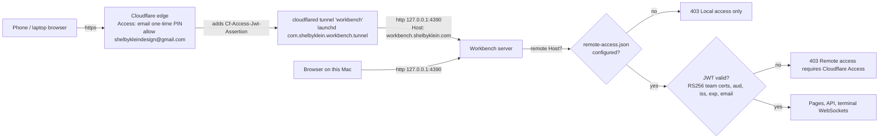

# Remote access through Cloudflare Zero Trust

Tracking: Tracker Trapper plan `local:E017EE98-50B5-4280-A964-E4C6B608C143` (todos RA-01…RA-10 match the Workflow table). No GitHub issue: the repository is public
and this plan describes the security boundary of a machine-exposed service; publish one only if the person asks.

## Summary

SKD Workbench is reachable only from this Mac (`127.0.0.1:4390`). This plan makes it reachable at
`https://workbench.shelbyklein.com` from the person's other devices. Cloudflare Access sits in front and admits
only `shelbykleindesign@gmail.com` after an emailed one-time PIN. The Workbench also verifies Cloudflare's signed
Access token on every remote request, so a misconfigured or deleted Access application still leaves it closed.

## Problem

- Today (observed): the server binds `127.0.0.1` (`server.js` `server.listen(port,'127.0.0.1')`) and rejects any
  Host that is not loopback (`server.js` `assert(/^(127\.0\.0\.1|localhost):\d+$/.test(host),'Local access only.')`);
  terminal WebSockets apply the same check with an `http://` origin (`lib/terminal-stream.js` `upgrade`). The
  person cannot use the Workbench away from this Mac.
- Risk that shapes the design: an authenticated Workbench session can open a real shell (workspace terminal) and
  launch Claude/Codex with the person's accounts. Remote access therefore needs strong identity at the edge plus
  an independent check at the origin.
- PWA detail (observed): `public/sw.js` serves the shell cache-first, and `public/app.js` `api()` follows redirects.
  When an Access session expires, Access answers with a redirect to `*.cloudflareaccess.com`; today that surfaces
  as "Local server unavailable" and a cached shell never reaches the login page.

## Desired flow

Local requests (loopback Host, `http://` origin) keep today's behavior with no login.

## Settled decisions

- Cloudflare Zero Trust Access with one-time PIN, single allowed email; no in-app PIN (person's choice).
- Server-side verification of `Cf-Access-Jwt-Assertion` (person confirmed the recommended scope).
- Always-on tunnel under its own launchd job, matching `com.agentos.tunnel`.
- Remote mode is opt-in through `<data>/remote-access.json`
  `{version:1, host, teamDomain, audience, allowedEmails[]}`. Absent → local-only. Corrupt → remote requests fail
  with a visible error and the server logs it; local use is unaffected.
- Local plan instead of a public GitHub issue (see Tracking).

## Success criteria

1. Without the config file, a request with `Host: workbench.shelbyklein.com` is refused exactly as today — Node test.
2. With the config, remote HTTP and WebSocket requests are admitted only with a valid Access JWT (signature, `aud`,
   `iss`, `exp`, allowed email) — Node tests with a fixture RSA key and JWKS.
3. Loopback use is unchanged — full `npm test` and `npm run test:browser` pass.
4. An unauthenticated request to `https://workbench.shelbyklein.com` is redirected to the Cloudflare Access login,
   and a direct request to the tunnel origin with a forged Host and no token gets 403 — live `curl` evidence.
5. The person signs in with the emailed PIN on another device and uses the Workbench, including a terminal — the
   person's check, plus a screenshot of the Access login page from the in-app browser.

## Deliverables

| Deliverable | End state |
| --- | --- |
| `lib/remote-access.js`, `server.js`, `lib/terminal-stream.js` changes and tests | Committed on `claude/great-chatterjee-278e44` |
| `public/app.js` / `public/sw.js` Access-expiry handling, cache version bump | Committed |
| `scripts/remote-access.mjs` + `npm run remote-access` to write/remove the config | Committed |
| README, AGENTS.md invariant wording, VALIDATION.md entry | Committed |
| Cloudflare Access application | Created by the person in the Zero Trust dashboard |
| Tunnel `workbench`, DNS CNAME, `~/.cloudflared/workbench.yml`, launchd plist | Created and running |
| Main checkout fast-forwarded, live server restarted, live `remote-access.json` written | After the person's go-ahead |
| Push to GitHub `main` | After the person's go-ahead |

## Workflow

| ID | Task | Acceptance |
| --- | --- | --- |
| RA-01 | Add `lib/remote-access.js`: config load/validate, JWKS fetch with cache and bounded refetch on unknown `kid`, RS256 JWT verification | `node --test tests/remote-access.test.js` passes: valid token accepted; missing, expired, not-yet-valid, wrong `aud`, wrong `iss`, bad signature, disallowed email, `alg` other than RS256 rejected; absent config → disabled; corrupt config → error |
| RA-02 | Gate HTTP requests in `server.js` | Tests via `createServer`: unconfigured remote Host → 403; configured without/with bad token → 403; valid token → 200 on `/api/health` and `/`; remote origin must be `https://<host>`; loopback requests unchanged |
| RA-03 | Gate terminal WebSocket upgrades in `lib/terminal-stream.js` | Test: remote upgrade without valid token is refused before `handleUpgrade`; with a valid token it connects; loopback unchanged |
| RA-04 | Handle Access expiry in the PWA (`api()` detects redirect; SW navigations on a non-loopback host check the network with `redirect:'manual'` and pass the Access redirect through, else serve the cached shell); bump `sw.js` cache | `tests/pwa-browser.mjs` and the new browser check pass; an `api()` call that receives a redirect reloads to the login instead of showing "Local server unavailable" |
| RA-05 | Add `scripts/remote-access.mjs` and docs (README, AGENTS.md, VALIDATION.md) | Script writes a validated file atomically (mode 0600) and `--disable` removes it, covered by a Node test; `npm test` passes; `npm run test:browser` passes |
| RA-06 | **Person:** create the Access application and send the team domain and AUD tag | Values received; `curl -sI https://workbench.shelbyklein.com` (after RA-07) returns a redirect to `<team>.cloudflareaccess.com` |
| RA-07 | Create tunnel `workbench`, DNS route, `~/.cloudflared/workbench.yml`, launchd job | `cloudflared tunnel info workbench` shows active connections; `launchctl list com.shelbyklein.workbench.tunnel` shows a PID |
| RA-08 | **Gate (person's go-ahead):** fast-forward the main checkout, write live `remote-access.json`, restart the live server after confirming no active execution | New server PID; `curl http://127.0.0.1:4390/api/health` → 200; forged-Host request without token → 403 |
| RA-09 | Verify end to end | Unauthenticated `curl` redirects to Access; in-app browser screenshot of the Access login inspected; the person confirms sign-in and a terminal session from another device |
| RA-10 | **Gate (person's go-ahead):** push to GitHub `main` | `origin/main` equals the verified commit |

Order: RA-01 → RA-02 → RA-03 → RA-04 → RA-05 (code, testable without Cloudflare). RA-06 can happen in parallel
with the code work. RA-07 needs RA-06 (so the hostname is protected before it resolves). RA-08 needs RA-05 and
RA-06. RA-09 needs RA-07 and RA-08. RA-10 last.

## Scope boundaries

Excluded: in-app PIN or accounts, multiple users, Access policies beyond one email, remote-only features, changing
the bind address, exposing controller (`/api/controller/call`) tokens differently than other API routes.

Must not change: loopback use without login; `127.0.0.1` binding; the public asset allowlist; existing data files
and schemas; execution ownership; explicit PWA updates (the cached shell is still what runs once signed in).

## Rollback

Nothing in existing data changes; `remote-access.json` is a new file. To undo in order:
1. `npm run remote-access -- --disable` (or delete `<data>/remote-access.json`) → remote Host refused immediately.
2. `launchctl bootout gui/$(id -u)/com.shelbyklein.workbench.tunnel` and remove its plist.
3. `cloudflared tunnel delete workbench`; remove the `workbench` CNAME in Cloudflare DNS.
4. Delete the Access application in Zero Trust.
5. `git revert` the delivery commit if the code itself must go.
Backup: none needed for existing records; the live `.data` is not modified other than the new file.

## Test plan

- `node --test tests/remote-access.test.js` (unit + `createServer` + WebSocket cases, fixture RSA key/JWKS server).
- `npm test` (full Node suite).
- `npm run test:browser` (full browser suite; `pwa-browser` and `terminal-stream-browser` are the most relevant).
- Live, non-UI evidence: `curl -sI https://workbench.shelbyklein.com` (Access redirect), forged-Host `curl` to
  `127.0.0.1:4390` without token (403), `cloudflared tunnel info workbench`.
- Rendered check: in-app browser at `https://workbench.shelbyklein.com` shows the Access login; screenshot inspected.
  The person completes the emailed-PIN sign-in (Claude does not enter credentials or codes).

## Open questions

None blocking. Access session length defaults to 24 hours in the Access application; the person can change it there.

## Work preparation

- Scope: confirmed 2026-09-23 (Zero Trust, server token check, always-on tunnel).
- Plan: this file. Tracker Trapper plan: `local:E017EE98-50B5-4280-A964-E4C6B608C143`.
- Mode: `linear` (solo). Executor: this Claude Code session, Opus 5.5 (`claude-opus-5-5`) at the session's current
  effort setting; no subagents.
- Recipient/handoff: none (solo).
- Now/later: now (2026-09-23). Live: team `skdesign.cloudflareaccess.com`, tunnel `workbench`; RA-01–RA-10 done
  (RA-09 confirmed by the person's private-window sign-in).
- Readiness: pass · 2026-09-23 · R3 flow diagram above (no Workbench screen changes; login page is Cloudflare's) ·
  R7 local plan, no GitHub issue by design · R12 rollback above (external services and a new data file).
- Remaining questions: none blocking.
