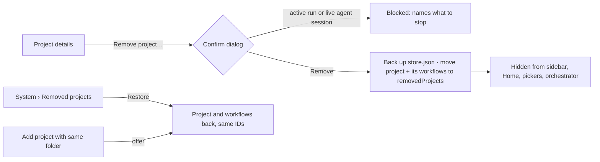

# Remove project (archive and restore)

Issue: https://github.com/shelbyklein/skd-workbench/issues/19 · Tracker Trapper plan `1E75F7D2-E5D7-4877-9D20-842B7362C0BC`
Todos RP-01…RP-05 match the Workflow table and the issue checklist.

## Summary

Workbench can add projects but never remove them. This plan adds **Remove project**: the project leaves the
sidebar, Home, pickers and the orchestrator's reach, while its folder, Git data and Workbench history stay untouched
and can be restored from **System › Removed projects**. Adding the same folder again offers to restore it.

## Problem

Observed (`codex/coordinator-cli-view` 5632bb0):

- `lib/store.js` has `createProject` and `updateProject` only; there is no remove or archive. `server.js` has no
  project delete route, and `public/app.js` `projectDialog()` (Project details) offers Save only
  (screenshot: [current-project-details.png](assets/remove-project/current-project-details.png)).
- The person registered a project named "SKD Workbench" that points at the Workbench's own checkout
  (`/Users/shelbyklein/Vibes/skd-workbench`). Its project agent works in that live checkout, and there is no way to
  take the project out of Workbench.
- `createProject` refuses a folder already connected to a project (409), so a stale entry also blocks re-adding.

Affects: the person, who cannot tidy the project list or keep agents out of a folder.

## Target

Sketch: [target-remove-project.svg](assets/remove-project/target-remove-project.svg).

Settled decisions (the person, 2026-09-23): **archive, not delete**; **restorable from the app**; **re-adding the
same folder offers restore**. Removal never touches the folder, Git data, branches or worktrees on disk.

## Design

- Store: `removedProjects: [{project, flows, removedAt}]` in `store.json`. Removing moves the project record and its
  saved workflows there, so every existing reader of `snapshot().projects` / `flows` ignores it without changes.
  Runs stay in `runs` (they carry `projectSnapshot`); readers that join runs to projects must skip unknown projects.
  Thread, mandate and agent-setting records are keyed by project ID and stay as they are; restore brings them back.
- Guards: refuse removal of `unassigned`, while a workflow run in that project is active, while the project's agent
  session is live, or with a stale project version (409). Removal writes `store.json.remove-<id>.backup.json` first.
- Grants: controller/coordinator grants keep working; project IDs that no longer exist are filtered wherever grants
  are recomputed or checked, so removal never makes grant validation fail.
- Routes: `POST /api/projects/:id/remove {version, confirm:true}`, `GET /api/removed-projects`,
  `POST /api/removed-projects/:id/restore`. `POST /api/projects` with a removed project's folder returns 409 with
  `removedProjectID` so the UI can offer Restore.
- UI: "Remove project…" section in Project details with a confirm dialog; **Removed projects** list under System with
  Restore (empty state "No removed projects."); Add project offers Restore for a removed folder; a link to a removed
  project shows "Project removed" with a link to System.

## Success criteria

1. Removing a project hides it everywhere and the orchestrator can no longer read or message it — `tests/remove-project.test.js`.
2. Removal is refused while a run or live agent session is active, and nothing changes — same test file.
3. Restore brings back the project, its workflows, thread and runs with the same IDs — same test file and browser suite.
4. The real UI path works: Project details › Remove → gone from sidebar; System › Restore → back — `tests/remove-project-browser.mjs`, screenshots in `output/`.
5. Full suites stay green — `npm test`, `npm run test:browser`.

## Deliverables

- Code, tests, README/VALIDATION notes: committed on a `codex/` branch — end state **committed**, merge awaits the person.
- GitHub issue with checklist — **published**.
- Removing the live "SKD Workbench" project — **the person's action** after merge and restart (RP-05).

## Workflow

| ID | Task | Acceptance check |
|---|---|---|
| RP-01 | Store: remove/restore/list with backup, guards, and removed-folder detection on create | `node --test tests/remove-project.test.js` covers remove, refuse (unassigned, stale version), restore with same IDs, backup file exists, create-with-removed-folder 409 |
| RP-02 | Server: routes, active-run and live-session guards, grant filtering, run/overview readers skip removed projects | Same test file: remove refused while run active / session live; orchestrator `list_projects` omits the removed project; `/api/agents/overview` does not error |
| RP-03 | UI: Remove in Project details, confirm dialog, System › Removed projects with Restore, Add-project restore offer, removed-project route | `node tests/remove-project-browser.mjs` passes through the real UI; screenshots show dialog, list, empty state, dark and 390 px |
| RP-04 | Docs and full validation | README and VALIDATION updated; `npm test` and `npm run test:browser` pass |
| RP-05 | **Person's gate:** merge, restart, remove "SKD Workbench" in the live app | The person confirms it is gone from the sidebar and listed under Removed projects |

## Scope boundaries

Excluded: permanent deletion; deleting or cleaning any folder, branch or worktree; moving runs between projects;
bulk removal. Unchanged: the `unassigned` project, existing IDs, run history records, thread/mandate files, add/edit
project behavior for folders that were never removed.

## Rollback

Each removal writes `store.json.remove-<projectID>.backup.json` first. To undo: Restore in System, or stop the
server and copy the backup over `store.json`. The code change adds an optional `removedProjects` array; older code
ignores it, so reverting the commits leaves the store readable (removed projects then stay hidden until restored
by the new code or the backup).

## Test plan

- `node --test tests/remove-project.test.js` (new), then `npm test`.
- `node tests/remove-project-browser.mjs` (new, fixture store and fixture CLI; entry point Project details button
  `#project-details` and System page), then `npm run test:browser`.
- Rendered checks: screenshots of the confirm dialog, System list, empty state, dark theme and 390 px.

## Open questions

None blocking.

## Work preparation

- Scope confirmed by the person 2026-09-23 ("ok do it", recommended options: archive, restore from app, restore offer on re-add).
- Mode: `linear`. Executor: this Claude Code session, Opus 5.5 (claude-opus-5-5), session effort.
- Now/later: now.
- Readiness: pass · 2026-09-23 · R1–R13 pass (R3: screenshot + sketch + flow diagram; R12: backup per removal and revert path).
