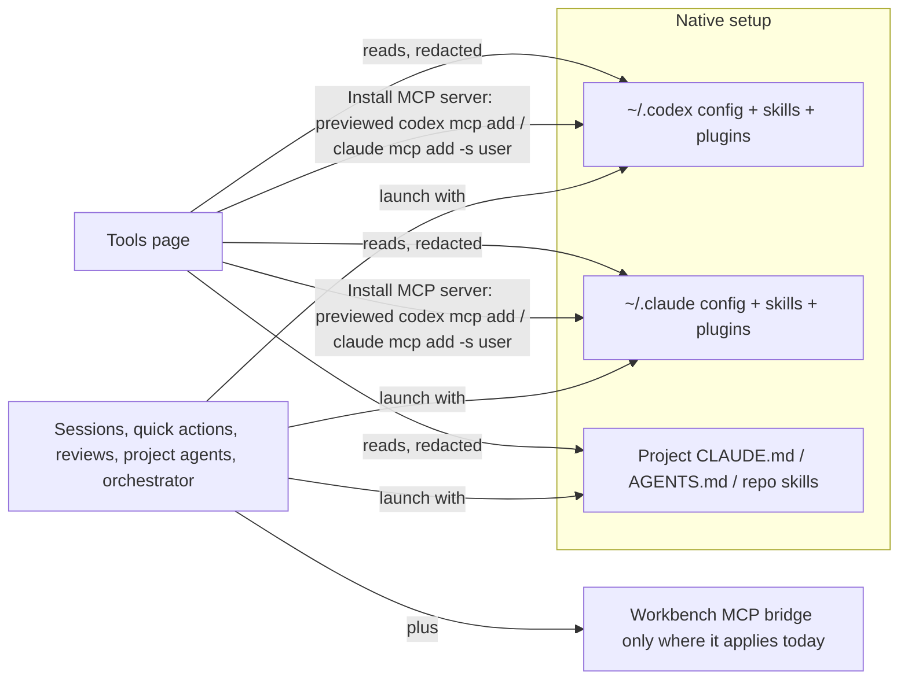

# Tools in concert: native skills and MCP for Codex and Claude

Issue: https://github.com/shelbyklein/skd-workbench/issues/20 · Tracker Trapper plan `5EDE10F7-A798-44A2-856C-BD3C5794212D`
Todos TC-01…TC-07 match the Workflow table and the issue checklist.

## Summary

Workbench currently splits skills and MCP servers per project and per launch, and runs the orchestrator in a private
Codex home. The person works with Codex and Claude together and wants both to use their normal setup everywhere,
with project context (instruction files, repo skills) doing the rest. This plan retires the per-project segmentation,
gives the orchestrator the real setup, and replaces Skills and Connections with one **Tools** page that shows what
each CLI can use and can install an MCP server into Codex, Claude or both.

## Problem

Observed (`main` df34914):

- Skills are copied into `.data/skills.json` and chosen per project/provider (`lib/skills.js` `savePolicy`, `resolve`),
  then injected as prompt text (`lib/agent-context.js` `deliveredInstructions`) into Codex/Claude runs
  (`lib/codex.js:83-90`), terminals (`lib/terminals.js:52-54`), workflows (`lib/workflows.js:45-53`) and quick actions.
- MCP is chosen per project (`lib/connections.js` `savePolicy`/`resolve`/`prepareLaunch`); managed terminal launches
  disable unselected Codex servers and run Claude with `--restricted --strict-mcp-config` and a private JSON file.
- Agents carry `skillIDs`/`connectionIDs`; `lib/playbooks.js` `preview`/`resolveLaunch` block launches when those change.
- The orchestrator runs Codex with `CODEX_HOME=.data/coordinator-codex` and Claude with `--strict-mcp-config`,
  `--setting-sources project`, `--disable-slash-commands` (`lib/coordinator-sessions.js:36-52,103`), so it lacked the
  person's dev-plan/dev-work/dev-sync skills (seen in the live thread 2026-09-24T01:42Z).
- Project agents already use the native setup plus only the Workbench bridge (`projectSessionArgs`), which is the model.
- UI: separate global and per-project **Skills** and **Connections** pages
  ([current-connections.png](assets/tools-in-concert/current-connections.png),
  [current-skills.png](assets/tools-in-concert/current-skills.png)); resource pickers in Agents and the pre-launch review.

Affects: the person, who has to curate per-project resources and cannot rely on both CLIs seeing the same tools.

## Target

Sketch: [target-tools.svg](assets/tools-in-concert/target-tools.svg).

Settled decisions (the person, 2026-09-23):

- **Retire segmentation**: sessions use each CLI's normal skills and MCP; per-project Skills/Connections pages,
  project policies and the skill/MCP pickers in Agents and launch review are hidden. Old records stay readable;
  nothing is deleted.
- **Orchestrator uses the real setup** (no private Codex home, no strict MCP), keeps the Workbench bridge and native
  permission prompts, and still has **no file or shell tools**.
- **Install MCP into native config**: `codex mcp add` / `claude mcp add -s user`, previewed as the exact command, run
  only after confirmation, without a shell.
- **One global Tools page**: Codex and Claude Code columns with MCP servers and skills (user, plugin, system and the
  selected project's repo skills).

## Success criteria

1. A terminal session, quick action, issue review and project agent launch with no Workbench-injected skills block and
   no managed MCP flags; the orchestrator launches without `CODEX_HOME` override or strict MCP flags but with
   `--tools ''`/read-only sandbox — `tests/tools-native-launch.test.js` and updated `tests/coordinator-sessions.test.js`.
2. `GET /api/tools?projectID=` returns both columns with redacted MCP servers and skills, starting no server —
   `tests/tools-inventory.test.js`.
3. Installing an MCP server previews the exact argv, refuses without confirmation, and runs the fixture CLI with that
   argv (no shell) for Codex, Claude or both — same test file with fixture binaries.
4. The Tools page lists both columns and installs through the dialog; old `#skills`/`#connections` routes land on Tools;
   no skill/MCP pickers remain in Agents or launch review — `tests/tools-browser.mjs` with screenshots (desktop,
   dark, 390 px).
5. `npm test` and `npm run test:browser` pass (suites that asserted segmentation are updated or retired with reason).

## Deliverables

- Code, tests, README/AGENTS.md/VALIDATION updates: committed on `codex/coordinator-cli-view`, then merged to `main`,
  pushed and the live server restarted (standing rule) — after the person's go-ahead.
- GitHub issue with checklist — published.
- Live check of the real inventory and one real install — the person's gate (TC-07).

## Workflow

| ID | Task | Acceptance check |
|---|---|---|
| TC-01 | Native launches: stop injecting managed skills and managed MCP in terminals, Codex/Claude runs, quick actions, issue review/planning; Agent preview/resolve uses prompt only | `node --test tests/tools-native-launch.test.js` shows argv without the skills block, `--strict-mcp-config`, `--restricted` or disabled-transport overrides for those paths; workflows, read-only and issue proposals stay MCP-free as before |
| TC-02 | Orchestrator on the real setup: drop the private `CODEX_HOME` and Claude strict/setting-source/slash flags; pass the Workbench server, approvals and hook as overrides; keep no built-in tools | Updated `tests/coordinator-sessions.test.js` passes; `coordinator-cli-browser` still passes (bridge, prompts, replies) |
| TC-03 | Tools inventory API: both CLIs' MCP servers (existing redacted readers) and skills (user, plugin, system, selected project) | `node --test tests/tools-inventory.test.js`: fixture homes produce both columns, secrets redacted, no process started |
| TC-04 | MCP install API: validated input → exact argv preview; confirmed run via `execFile` for Codex, Claude or both; bounded output; no secret values persisted by Workbench | Same test file: preview argv exact, 400 without confirm, fixture CLIs record the argv, partial failure reported per CLI |
| TC-05 | UI: global Tools page with columns, details and Install MCP dialog; hide per-project Skills/Connections and the resource pickers; old routes redirect | `node tests/tools-browser.mjs` passes through the real UI; screenshots inspected (desktop, dark, 390 px) |
| TC-06 | Docs, `AGENTS.md` invariants, retire/adjust segmentation tests, full validation | `npm test` and `npm run test:browser` pass; README/AGENTS.md describe the new rules |
| TC-07 | **Person's gate:** merge, push, restart; check the live Tools page and install one real server | The person confirms their real skills/MCP appear for both CLIs and the installed server shows in both CLI lists |

## Scope boundaries

Excluded: removing or editing existing MCP servers from Workbench (terminal only for now); OAuth flows; changing Agent
prompts/provider/model; giving the orchestrator file or shell tools; MCP for workflows, read-only sessions and issue-edit
proposals (unchanged); deleting `.data/skills.json`, `.data/connections.json` or Agent resource fields.
Unchanged: native CLI permission prompts, sandbox/read-only modes, loopback/remote-access guards, Workbench MCP bridge
tools and grants, historical run/session records (they keep the skills/MCP they recorded).

## Rollback

Data: no Workbench store is migrated; skills, connections and Agent resource fields stay on disk and readable, so
reverting the commits restores the old behavior. MCP installs change the person's CLI config: each install result shows
the matching `codex mcp remove <name>` / `claude mcp remove -s user <name>` command to undo it. No backup of CLI config
is taken by Workbench (the CLIs own those files); the preview names the file each command changes.

## Test plan

- New: `tests/tools-native-launch.test.js`, `tests/tools-inventory.test.js` (fixture CLI binaries and fixture homes),
  `tests/tools-browser.mjs` (entry: sidebar/Home **Tools** link, Install MCP server dialog; screenshots desktop, dark,
  390 px).
- Updated or retired with reason: `skills.test.js`, `connections.test.js`, `playbooks.test.js`, `agent-profiles.test.js`,
  `launch-context.test.js`, `coordinator-sessions.test.js`, `resources-browser.mjs`, `managed-connections-browser.mjs`,
  `playbooks-browser.mjs`.
- Then `npm test` and `npm run test:browser`.

## Open questions

None blocking. (Non-blocking: whether to add "remove server" later.)

## Work preparation

- Scope confirmed by the person 2026-09-23 (retire segmentation; orchestrator real setup without file/shell tools;
  install via native `mcp add`; one global Tools page).
- Mode: `linear` (the person: "get to work", no handoff). Executor: this Claude Code session, Opus 5.5 (claude-opus-5-5), session effort.
- Now/later: now.
- Readiness: pass · 2026-09-23 · R1–R13 pass (R3: two screenshots, sketch, flow diagram; R12: no store migration, per-install remove command).
