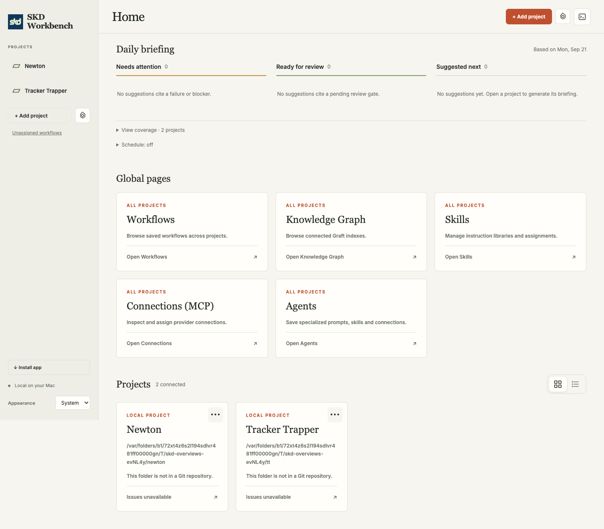
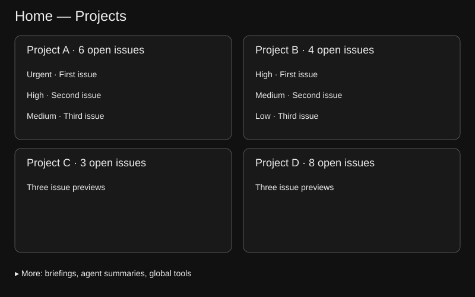
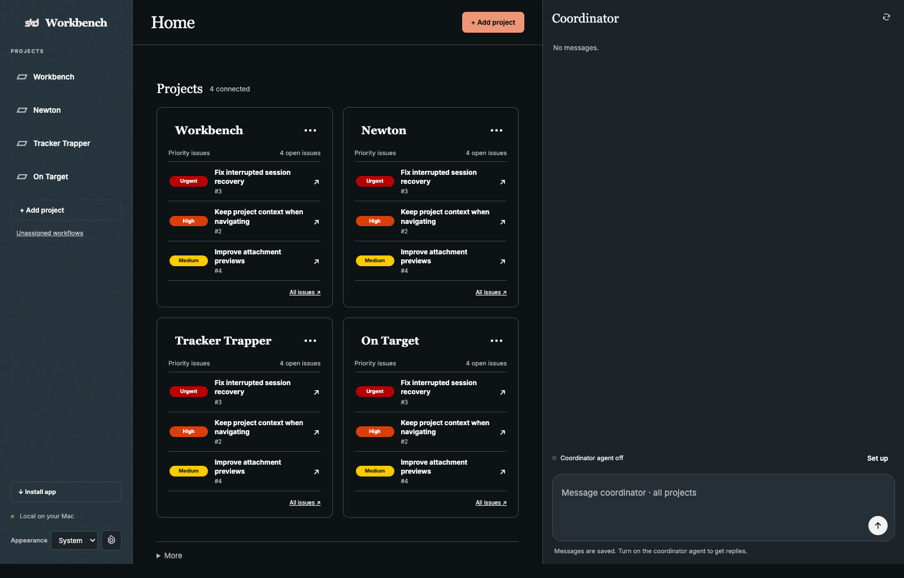
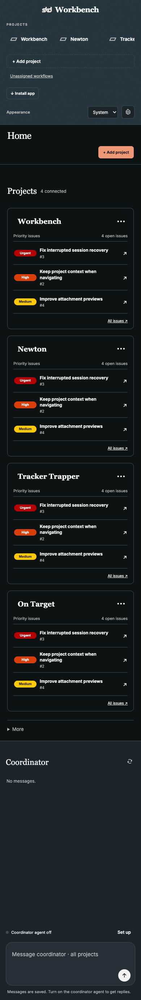

# Home project overview

Home currently places agent summaries, daily briefings and global utility cards ahead of projects (`public/app.js`, renderProjects). Put all project cards first in a two-column grid, with three priority-sorted open issue previews per card. Four projects occupy two rows; additional projects continue below and mobile uses one column.

Secondary Home sections move into a collapsed More disclosure. Preserve routes, the coordinator, project/tag navigation and all stored data. Compact project cards omit filesystem/repository detail, retain tag editing, and open issues in their own project's scope. The existing first-page issue API returns up to 50 recent records: sort this bounded set and disclose partial coverage when more exist; never claim the global highest priority across unloaded pages. Limit concurrent requests to three. Loading, empty and unavailable results remain distinct.

- [x] HP-01 — Implement the project-first Home grid and issue previews. Acceptance: browser fixture verifies four cards in two columns, three priority-sorted issues, correct project issue links, empty/error states, and collapsed secondary sections.
- [x] HP-02 — Verify responsive behavior and record delivery. Acceptance: affected Home/navigation/tag/count/briefing tests pass, inspected desktop/mobile screenshots show no overflow, cache version and VALIDATION are updated and scoped source is committed.

Success: all projects visible before supplementary sections; useful issue summaries; keyboard/mobile navigation preserved. Deliverables: local committed source, test, screenshots and this plan; push/merge remain pending. No live restart or provider execution. No schema change; rollback scoped source and bump shell cache again if activated.

Validation: `node tests/home-project-overview-browser.mjs`, `node tests/overview-browser.mjs`, `node tests/project-tags-browser.mjs`, `node tests/project-counts-browser.mjs`, `node tests/sidebar-browser.mjs`, and affected briefing/agent browser coverage. Use temporary stores and fixture providers only.

Work preparation: user requests implementation now; linear execution in this session, gpt-6-astra low effort as verified in session metadata; retained solo preference, no handoff. No blocking questions. Scope includes collapsing secondary content, not deleting capabilities. Issue: https://github.com/shelbyklein/skd-workbench/issues/21. Tracker Trapper: 8839AA8A-F20E-407C-BBE8-0F031071A777. Readiness: R1–R13 pass. Issue closure requires user acceptance.

## Evidence

Eight affected browser suites passed: home-project-overview, overview, project-tags, project-counts, sidebar, briefing, hub-orchestrator, tools. Tests use temporary stores and fixture CLIs, not live providers. New coverage verifies two-column geometry, three sorted previews, project-scoped issue navigation with Enter, collapsed More, partial/empty/error states, and mobile overflow. Source syntax and diff whitespace checks passed; Graft refreshed. No live restart, push or user acceptance claimed.

Implementation: `e6cc12a` on `codex/home-project-overview`. Local source complete; push/merge and installed PWA acceptance remain pending.
